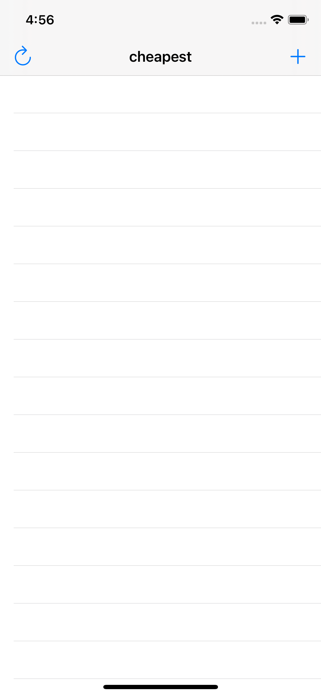
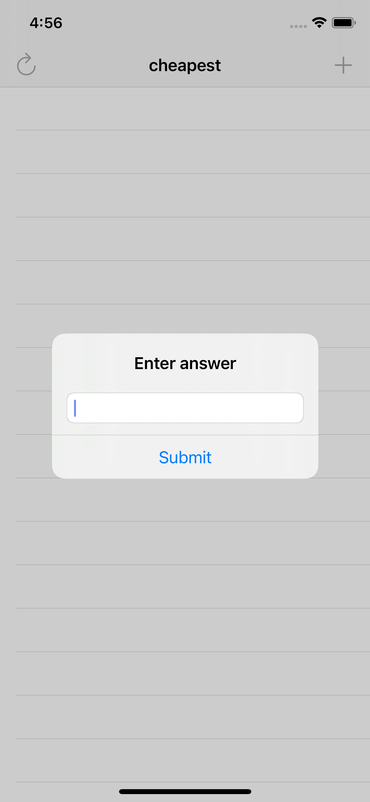
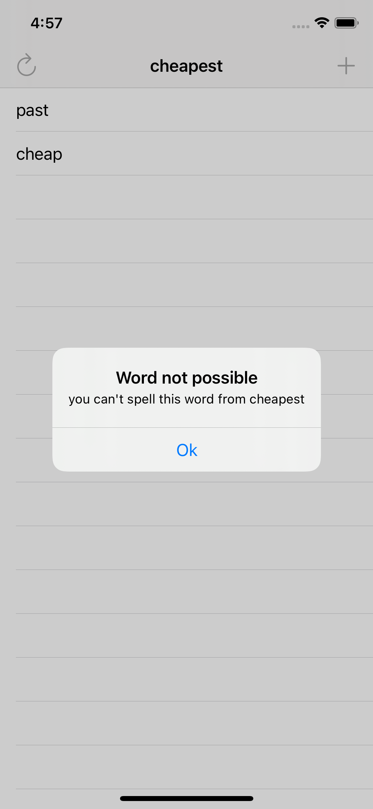

# BookWorm
This game contains one long word and you should create different word from it. 
## Tools implemented in project
  - Bundle.main.url
  - String(contentsof:)
  - textField
  - .components(separetedBy:)
  - UITextChecker
  - NSRange
 
 ## Project Screen Shots
 

## More features soon 
- colorfullness
- score
- liderboard 
  
## Conclusion 
It was interesting project which helped me to understand how works strings and Bundle.
Even though it was a basic app, it was chalanging for me and takes three days to finish. 
I'm satisfied with work i've done and will return to make this up even more beautiful.
